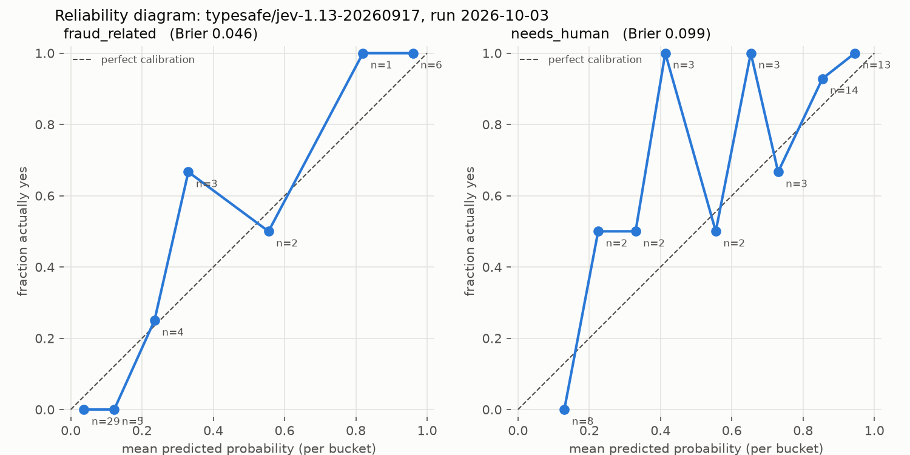
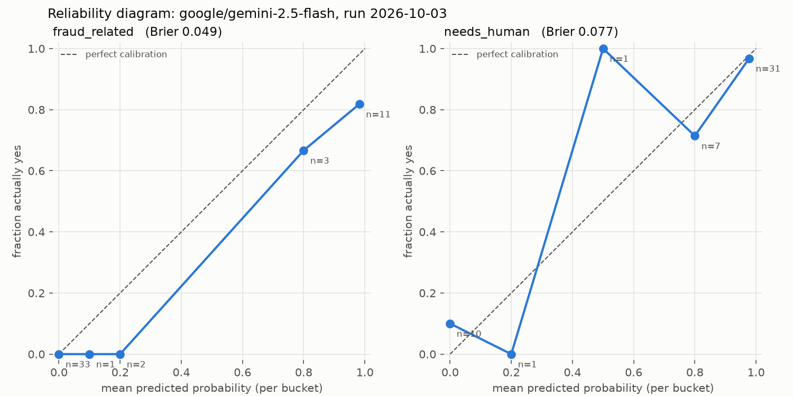

# Fintech Support Message Triager

A small API that reads a customer support message and decides what should happen to it: answer it automatically, put it in a review queue, or escalate it to a person now. It is built on **Jev**, TypeSafe AI's System One model, as a hands-on learning project.

https://github.com/user-attachments/assets/f02d7a84-9181-40c7-8fab-96bdcd45810b

## The problem

A fintech support inbox mixes very different messages:

- "Someone took $480 out of my account last night."
- "How do I download last month's statement?"
- "locked out"

Some can be answered from the help center. Others involve money leaving an account right now. Triage has to get two kinds of error right:

- **Missing a risky message** (suspected fraud, an account takeover) means money is lost while it waits in a queue.
- **Escalating everything** buries the people who handle the real cases.

Messages are also messy: very short, sarcastic, written in non-native English, mentioning "fraud" without being about it, or covering two issues at once. Keyword rules alone miss most of this, and a model alone can fail or be wrong with no warning.

## The solution

Each message gets one request to Jev with four typed questions. Each answer comes back with probabilities, not just a label:

| Question | Type | Answer |
|---|---|---|
| `category` | choice | `unauthorized_charge`, `billing_question`, `account_access`, `card_issue` or `other`, with a probability per label |
| `urgency` | score | 0 low, 1 medium, 2 high, as a probability-weighted score |
| `fraud_related` | noul (yes/no) | probability the customer suspects someone else used their account, card or money |
| `needs_human` | noul (yes/no) | probability a person should handle it rather than an automated reply |

The answers then go through a **routing layer** that picks one action. Deterministic rules run first and work even when the model call fails:

1. **Backstop rules (no model needed):**
   - model call failed → `review`
   - fraud keywords such as "unauthorized", "stolen" or "hacked" → `escalate`
   - three words or fewer → `review`
2. **Model thresholds:**
   - `fraud_related` ≥ 0.25 → `escalate`
   - urgency most likely high → `escalate`
   - `needs_human` ≥ 0.20 → `review`
   - category confidence < 0.5 → `review`
3. Otherwise → `auto_handle`.

The most severe action wins, and every rule that fired is returned as a reason. The thresholds were chosen from an evaluation on 50 hand-labeled synthetic messages, set to catch every message that needed a person (see `docs/notes.md`). Exact label and question definitions are in `docs/definitions.md`.

## The triage API

`POST /v1/triage/`

Request:

```json
{ "message": "unknown charge $73" }
```

The message must be 1 to 2,000 characters after trimming whitespace; otherwise the API returns `422`.

Response (illustrative; answer values taken from an evaluation run of Jev 1.13):

```json
{
  "success": true,
  "message": "Message triaged",
  "data": {
    "action": "escalate",
    "reasons": ["very short (3 words)", "fraud_related 0.37 >= 0.25", "needs_human 0.9 >= 0.2"],
    "model_ok": true,
    "model_error": null,
    "model": "typesafe/jev-1.13-20260917",
    "answers": {
      "category": {
        "label": "unauthorized_charge",
        "confidence": 0.96,
        "probabilities": {"unauthorized_charge": 0.97, "billing_question": 0.03, "account_access": 0, "card_issue": 0, "other": 0}
      },
      "urgency": {"score": 1.15, "most_likely_level": 1, "confidence": 0.77, "probabilities": {"0": 0, "1": 0.85, "2": 0.15}},
      "fraud_related": 0.37,
      "needs_human": 0.9
    },
    "latency_ms": 364,
    "disclaimer": "Learning project. Not suitable for real fraud, compliance or credit decisions."
  },
  "status_code": 200
}
```

How it behaves:

- **If Jev fails** (timeout, rate limit, bad response), the API still answers with HTTP 200, `model_ok: false` and `answers: null`. The action then comes from the backstop rules only: `review`, or `escalate` on a fraud keyword. There are no retries and no made-up model values.
- **`model`** reports the model version that actually answered.
- **The message text is never logged.** Only the action, whether the model answered, and latency are.

## Jev vs an LLM with structured JSON output

To see what a System One model adds, the same triager was also built on a general LLM. Both were run on the same 50 hand-labeled synthetic messages (dataset v1).

| | Jev | LLM baseline |
|---|---|---|
| Model | `typesafe/jev-1.13` (reported `typesafe/jev-1.13-20260917`) | `google/gemini-2.5-flash` |
| How it is asked | 4 typed questions (choice, score, noul, noul) in one request | One chat request with a strict JSON schema, temperature 0 |
| Question wording | `config.py` | The same wording, turned into a prompt |
| What comes back | Computed probabilities for every label and level | One chosen label/level, plus a probability the model *writes* for each yes/no question |
| Run file | `data/runs/2026-10-03T125726Z_typesafe_jev-1.13.json` | `data/runs/2026-10-03T182044Z_google_gemini-2.5-flash.json` |

Both were called through OpenRouter on 2026-10-03.

### Results

| Metric | Jev | Gemini 2.5 Flash |
|---|---|---|
| Category accuracy | **0.96** (48/50) | 0.88 (44/50) |
| Urgency accuracy (most likely level) | 0.90 | 0.90 |
| fraud_related at 0.5: precision / recall | 0.89 / 0.73 | 0.79 / 1.00 |
| fraud_related Brier score (lower is better) | 0.046 | 0.049 |
| needs_human at 0.5: precision / recall | 0.91 / 0.86 | 0.92 / 0.97 |
| needs_human Brier score (lower is better) | 0.099 | **0.077** |
| Latency per message: median / max | **0.40 s** / 1.16 s | 1.65 s / 2.97 s |
| Cost per message | **$0.00003** | $0.000225 |
| Cost for all 50 messages | **$0.0015** | $0.0113 |
| Mean input tokens | 720 | 451 (+36 output) |
| Malformed outputs | 0 | 0 (after a schema fix, see below) |
| Routing (model + rules): messages that needed a person but were auto-handled | 0* | 1 |

\* The routing thresholds were tuned on Jev's own answers on these same messages, so this row favors Jev.

Reliability diagrams (predicted probability vs how often the label was actually yes):

| Jev | Gemini 2.5 Flash |
|---|---|
|  |  |

### What the comparison shows

- **Jev is faster and cheaper:** about 4x lower median latency and about 7.5x lower cost per message, even though it used more input tokens ($0.042 per million input tokens vs $0.30, and output is free).
- **Jev was more accurate on category** (0.96 vs 0.88). Five of the LLM's six category misses were messages labeled `other` that it forced into a specific label.
- **The LLM was better on needs_human** (Brier 0.077 vs 0.099) and caught more fraud at the 0.5 threshold. Urgency was a tie.
- **Probabilities you can tune vs probabilities that are written:**
  - Jev's probabilities are computed and spread across the range, so moving a threshold changes results gradually.
  - The LLM writes its probabilities in 0.1 steps and clusters them at 0 and 1. For fraud, 33 of 50 were exactly 0.0, and messages it scored about 0.98 were fraud only 82% of the time. Its precision and recall barely change between thresholds 0.3 and 0.7, so there is little to tune.
- **Output reliability:** Jev's answers are typed by design. With the LLM, an integer `enum` in the JSON schema made Gemini return `{}` for every message, with HTTP 200 and no error. It was only caught because every reply is validated. Fixed by removing the enum.

### Caveats

- 50 messages and one run per model, so differences of 1–3 messages are within noise. Run-to-run variation was not measured.
- Labels are one person's judgment, and the needs_human labels are cautious (74% yes). Calibration is measured against those labels.
- Gemini 2.5 Flash is a small, fast LLM. A larger LLM may score differently.

To reproduce the comparison from the saved runs (no API calls):

```bash
uv run scripts/3_evaluate.py data/runs/<run>.json     # accuracy, precision/recall, latency, cost, worst misses
uv run scripts/4_calibration.py data/runs/<run>.json  # calibration table and reliability diagram
uv run scripts/5_routing.py data/runs/<run>.json      # routing replay
```

## Run it locally

Prerequisites: Python 3.12, [uv](https://docs.astral.sh/uv/), and an [OpenRouter](https://openrouter.ai) API key with some credit. Jev is reached through OpenRouter.

```bash
git clone <repository-url> fintech-support-message-triager
cd fintech-support-message-triager

uv sync                      # creates .venv and installs dependencies
cp .env.example .env         # then edit .env
```

In `.env`:

- Set `OPENROUTER_API_KEY` to your key. The app will not start without it.
- `MONGO_URI`, `DB_NAME` and `JWT_SECRET` must have values. They come from the FastAPI boilerplate this app is built on. The example values are fine, and the triage endpoint does not need a running MongoDB.

Never commit `.env`; it is already in `.gitignore`.

Start the server:

```bash
uv run fastapi dev app/main.py
```

Try it:

```bash
curl -X POST http://localhost:8000/v1/triage/ \
  -H 'Content-Type: application/json' \
  -d '{"message": "Someone used my card at a gas station 300 miles away."}'
```

Interactive API docs: <http://localhost:8000/docs>

Run the tests (no API calls, no database):

```bash
uv run pytest
```
